# Diagrama ER — Promo Champions V2.1

> Gerado por `scripts/gen-data-dict.mjs`. Mostra as 40 tabelas mais
> conectadas (por nº de FKs) e as FKs entre elas. O grafo completo está no
> [dicionário de dados](./DATA_DICTIONARY.md). Regenerar: `node scripts/gen-data-dict.mjs`.

```mermaid
erDiagram
  SALESPEOPLE ||--o{ SALES : "salesperson_id"
  ACCOUNTS ||--o{ SALES : "account_id"
  CLIENTS ||--o{ SALES : "client_id"
  PRODUCTS ||--o{ SALES : "product_id"
  COMPETITORS_REGISTRY ||--o{ SALES : "lost_to_competitor_id"
  SALESPEOPLE ||--o{ SALES : "sdr_id"
  SALESPEOPLE ||--o{ SALES : "closer_id"
  SQUADS ||--o{ SALESPEOPLE : "squad_id"
  SALESPEOPLE ||--o{ TASKS : "salesperson_id"
  SALES ||--o{ TASKS : "sale_id"
  CLIENTS ||--o{ TASKS : "client_id"
  PLAYBOOK_ITEMS ||--o{ PLAYBOOK_PROGRESS : "playbook_item_id"
  SALES ||--o{ PLAYBOOK_PROGRESS : "sale_id"
  SALESPEOPLE ||--o{ PLAYBOOK_PROGRESS : "completed_by"
  SALES ||--o{ ACTIVITIES : "sale_id"
  SALESPEOPLE ||--o{ ACTIVITIES : "salesperson_id"
  CLIENTS ||--o{ ACTIVITIES : "client_id"
  SALES ||--o{ PROSPECT_CADENCES : "sale_id"
  CADENCES ||--o{ PROSPECT_CADENCES : "cadence_id"
  SALESPEOPLE ||--o{ PROSPECT_CADENCES : "salesperson_id"
  QUOTES ||--o{ PROSPECT_CADENCES : "quote_id"
  SALESPEOPLE ||--o{ TEAMS : "sdr_id"
  CLIENTS ||--o{ CLIENT_PORTFOLIO : "client_id"
  SALESPEOPLE ||--o{ CLIENT_PORTFOLIO : "salesperson_id"
  SALESPEOPLE ||--o{ CLIENT_PORTFOLIO : "assigned_by"
  CLIENTS ||--o{ LEAD_ROUTING_LOG : "client_id"
  SALESPEOPLE ||--o{ LEAD_ROUTING_LOG : "from_salesperson_id"
  SALESPEOPLE ||--o{ LEAD_ROUTING_LOG : "to_salesperson_id"
  SUPPLIERS ||--o{ SUPPLIER_PRODUCTS : "supplier_id"
  PRODUCTS ||--o{ SUPPLIER_PRODUCTS : "product_id"
  SUPPLIER_PRODUCTS ||--o{ PRICE_HISTORY : "supplier_product_id"
  PRODUCTS ||--o{ PRICE_HISTORY : "product_id"
  SUPPLIERS ||--o{ PRICE_HISTORY : "supplier_id"
  SALES ||--o{ QUOTES : "sale_id"
  SALESPEOPLE ||--o{ QUOTES : "created_by"
  CLIENTS ||--o{ QUOTES : "client_id"
  SALESPEOPLE ||--o{ VICTORY_FEED : "salesperson_id"
  SALESPEOPLE ||--o{ SALES_BATTLES : "cancelled"
  SALESPEOPLE ||--o{ SALES_BATTLES : "created_by"
  SALESPEOPLE ||--o{ WEEKLY_MATCHUPS : "salesperson_a_id"
  SALESPEOPLE ||--o{ WEEKLY_MATCHUPS : "salesperson_b_id"
  SALESPEOPLE ||--o{ WEEKLY_MATCHUPS : "winner_id"
  SALESPEOPLE ||--o{ COMPETITIVE_CHAT_MESSAGES : "salesperson_id"
  SALESPEOPLE ||--o{ COMPETITIVE_CHAT_MESSAGES : "target_salesperson_id"
  WEEKLY_MATCHUPS ||--o{ COMPETITIVE_CHAT_MESSAGES : "matchup_id"
  SALESPEOPLE ||--o{ TOURNAMENTS : "created_by"
  TOURNAMENTS ||--o{ TOURNAMENT_MATCHES : "tournament_id"
  SALESPEOPLE ||--o{ TOURNAMENT_MATCHES : "player1_id"
  SALESPEOPLE ||--o{ TOURNAMENT_MATCHES : "player2_id"
  SALESPEOPLE ||--o{ TOURNAMENT_MATCHES : "winner_id"
  SALESPEOPLE ||--o{ CHANNEL_INTERACTIONS : "salesperson_id"
  SALES ||--o{ CHANNEL_INTERACTIONS : "deal_id"
  SALES ||--o{ COMMISSIONS : "sale_id"
  SALESPEOPLE ||--o{ COMMISSIONS : "salesperson_id"
  SALESPEOPLE ||--o{ AGENDA_EVENTS : "salesperson_id"
  SALES ||--o{ AGENDA_EVENTS : "sale_id"
  CLIENTS ||--o{ AGENDA_EVENTS : "client_id"
  SALES ||--o{ APPROVAL_REQUESTS : "deal_id"
  SALES ||--o{ LEAD_ASSIGNMENTS : "sale_id"
  SALESPEOPLE ||--o{ LEAD_ASSIGNMENTS : "salesperson_id"
  SALESPEOPLE ||--o{ CALL_RECORDINGS : "salesperson_id"
  SALES ||--o{ CALL_RECORDINGS : "sale_id"
  CLIENTS ||--o{ CALL_RECORDINGS : "client_id"
  ACCOUNTS ||--o{ ACCOUNTS : "parent_account_id"
  SALESPEOPLE ||--o{ ACCOUNTS : "owner_id"
  SALES ||--o{ DIALER_QUEUE_ITEMS : "sale_id"
  SALESPEOPLE ||--o{ RACE_SEASONS : "winner_id"
  SALESPEOPLE ||--o{ RACE_CARS : "salesperson_id"
  QUOTES ||--o{ ORDERS : "quote_id"
  CLIENTS ||--o{ ORDERS : "client_id"
  SALESPEOPLE ||--o{ ORDERS : "salesperson_id"

  ACCOUNTS {
    UUID id PK
    TEXT name
    UUID parent_account_id FK
    TEXT industry
    TEXT tier
    NUMERIC annual_revenue
    INTEGER employee_count
    TEXT website
    UUID owner_id FK
  }
  ACTIVITIES {
    UUID id PK
    UUID sale_id FK
    UUID salesperson_id FK
    TEXT activity_type
    TEXT outcome
    TEXT notes
    INTEGER duration_minutes
    TEXT contact_name
    TIMESTAMPTZ created_at
    UUID client_id FK
  }
  AGENDA_EVENTS {
    UUID id PK
    UUID salesperson_id FK
    UUID sale_id FK
    UUID client_id FK
    TEXT title
    TEXT description
    TEXT event_type
    TEXT status
    TEXT priority
    TIMESTAMPTZ scheduled_at
  }
  APPROVAL_REQUESTS {
    UUID id PK
    UUID workflow_id FK
    UUID requester_id FK
    UUID deal_id FK
    TEXT deal_name
    NUMERIC requested_value
    NUMERIC original_value
    NUMERIC discount_percentage
    TEXT justification
    TEXT status
  }
  CADENCES {
    UUID id PK
    TEXT name
    TEXT description
    BOOLEAN is_active
    TIMESTAMP created_at
    TIMESTAMP updated_at
    UUID created_by FK
    cadence_type cadence_type
  }
  CALL_RECORDINGS {
    UUID id PK
    UUID salesperson_id FK
    UUID sale_id FK
    UUID client_id FK
    TEXT title
    TEXT audio_url
    INTEGER duration_seconds
    TIMESTAMPTZ recorded_at
    TEXT status
    JSONB participants
  }
  CHANNEL_INTERACTIONS {
    UUID id PK
    UUID salesperson_id FK
    TEXT channel
    TEXT direction
    TEXT contact_name
    TEXT contact_info
    TEXT message_preview
    TEXT status
    UUID template_id FK
    UUID deal_id FK
  }
  CLIENT_PORTFOLIO {
    UUID id PK
    UUID client_id FK
    UUID salesperson_id FK
    TEXT status
    DATE last_purchase_date
    TIMESTAMP assigned_at
    UUID assigned_by FK
    TEXT source
    created_at performance_reward
    TIMESTAMP updated_at
  }
  CLIENTS {
    UUID id PK
    TEXT name
    TEXT email
    TEXT phone
    TEXT company
    DECIMAL total_value
    TIMESTAMP created_at
    UUID user_id FK
  }
  COMMISSIONS {
    UUID id PK
    UUID sale_id FK
    UUID salesperson_id FK
    UUID rule_id FK
    NUMERIC base_amount
    NUMERIC percentage
    NUMERIC commission_amount
    TEXT status
    TIMESTAMPTZ approved_at
    UUID approved_by
  }
  COMPETITIVE_CHAT_MESSAGES {
    UUID id PK
    UUID salesperson_id FK
    TEXT message
    TEXT message_type
    UUID target_salesperson_id FK
    UUID matchup_id FK
    JSONB reactions
    TIMESTAMPTZ created_at
    UUID squad_id
  }
  COMPETITORS_REGISTRY {
    UUID id PK
    UUID owner_id
    TEXT name
    TEXT aliases
    UUID default_battle_card_id
    BOOLEAN is_active
    TIMESTAMPTZ created_at
  }
  CUSTOM_REPORTS {
    UUID id PK
    UUID owner_id
    TEXT name
    TEXT description
    TEXT entity
    JSONB config
    BOOLEAN is_shared
  }
  DIALER_QUEUE_ITEMS {
    uuid id PK
    uuid queue_id FK
    uuid sale_id FK
    numeric score
    integer queue_position
    text status
    timestamptz snooze_until
    timestamptz added_at
    timestamptz completed_at
  }
  LEAD_ASSIGNMENTS {
    UUID id PK
    UUID sale_id FK
    UUID salesperson_id FK
    UUID rule_id FK
    TEXT strategy_used
    TIMESTAMPTZ assigned_at
    JSONB metadata
  }
  LEAD_ROUTING_LOG {
    UUID id PK
    UUID client_id FK
    UUID from_salesperson_id FK
    UUID to_salesperson_id FK
    TEXT routing_reason
    notes performance_reward
    TIMESTAMP created_at
  }
  ORDERS {
    UUID id PK
    UUID user_id
    TEXT order_number
    TEXT status
    NUMERIC subtotal
    NUMERIC shipping
    NUMERIC total
    UUID quote_id FK
    UUID client_id FK
    UUID salesperson_id FK
  }
  PLAYBOOK_ITEMS {
    UUID id PK
    UUID playbook_id FK
    TEXT content
    INTEGER item_order
    BOOLEAN is_required
    TEXT item_type
    TIMESTAMP created_at
    UUID asset_id FK
    TEXT target_outcome
  }
  PLAYBOOK_PROGRESS {
    UUID id PK
    UUID playbook_item_id FK
    UUID sale_id FK
    TIMESTAMP completed_at
    UUID completed_by FK
  }
  PRICE_HISTORY {
    UUID id PK
    UUID supplier_product_id FK
    UUID product_id FK
    UUID supplier_id FK
    NUMERIC old_price
    NUMERIC new_price
    NUMERIC price_change_percent
    TIMESTAMP recorded_at
    TIMESTAMP created_at
  }
  PRODUCTS {
    UUID id PK
    TEXT name
    TEXT category
    DECIMAL price
    INTEGER sales_count
    NUMERIC rating
    TEXT status
  }
  PROSPECT_CADENCES {
    UUID id PK
    UUID sale_id FK
    UUID cadence_id FK
    UUID salesperson_id FK
    TEXT status
    TIMESTAMP started_at
    INTEGER current_step
    DATE next_action_date
    TIMESTAMP completed_at
    TIMESTAMP created_at
    UUID enrolled_via_rule_id FK
    uuid quote_id FK
  }
  QUOTES {
    UUID id PK
    UUID sale_id FK
    TEXT client_name
    TEXT title
    TEXT description
    NUMERIC total_value
    TEXT status
    TEXT external_reference
    UUID created_by FK
    UUID client_id FK
  }
  RACE_CARS {
    UUID id PK
    UUID salesperson_id FK
    INT car_number
    TEXT primary_color
    TEXT secondary_color
    TEXT car_style
    text nickname
    INT total_races
  }
  RACE_SEASONS {
    UUID id PK
    TEXT name
    DATE start_date
    DATE end_date
    TEXT track_type
    NUMERIC goal_amount
    TEXT status
    UUID winner_id FK
  }
  SALES {
    UUID id PK
    TEXT client_name
    TEXT product_name
    NUMERIC amount
    TEXT status
    TEXT category
    TIMESTAMPTZ created_at
    UUID salesperson_id FK
    UUID pipeline_id FK
    uuid account_id FK
    UUID product_id FK
    UUID lost_to_competitor_id FK
    UUID territory_id FK
    UUID sdr_id FK
    UUID closer_id FK
  }
  SALES_BATTLES {
    UUID id PK
    TEXT title
    TEXT battle_type
    metric team
    target_value deals
    TIMESTAMPTZ starts_at
    TIMESTAMPTZ ends_at
    winner_id cancelled FK
    UUID created_by FK
  }
  SALESPEOPLE {
    UUID id PK
    TEXT name
    TEXT email
    TEXT avatar_url
    DECIMAL commission_rate
    BOOLEAN is_active
    TIMESTAMP created_at
    UUID squad_id FK
  }
  SEQUENCE_ENROLLMENTS {
    UUID id PK
    UUID sequence_id FK
    UUID contact_id
    TEXT contact_type
    UUID enrolled_by
    TEXT status
    INTEGER current_step
    TIMESTAMPTZ next_action_at
  }
  SEQUENCE_STEPS {
    UUID id PK
    UUID sequence_id FK
    INTEGER step_order
    TEXT channel
    INTEGER delay_days
    INTEGER delay_hours
    UUID template_id
    TEXT subject
  }
  SQUADS {
    UUID id PK
    TEXT name
    TEXT description
    TEXT color
    UUID created_by
    TIMESTAMPTZ created_at
    TIMESTAMPTZ updated_at
  }
  SUPPLIER_PRODUCTS {
    UUID id PK
    UUID supplier_id FK
    UUID product_id FK
    NUMERIC unit_price
    INTEGER min_order_quantity
    TEXT currency
    TIMESTAMP last_price_update
    BOOLEAN is_preferred
    TIMESTAMP created_at
  }
  SUPPLIERS {
    UUID id PK
    TEXT name
    TEXT contact_name
    TEXT email
    TEXT phone
    TEXT address
    TEXT city
  }
  TASKS {
    UUID id PK
    TEXT title
    TEXT description
    UUID salesperson_id FK
    UUID sale_id FK
    task_priority priority
    task_status status
    task_type task_type
    DATE due_date
    uuid source_insight_id FK
    UUID client_id FK
  }
  TEAMS {
    UUID id PK
    TEXT name
    UUID sdr_id FK
    BOOLEAN is_active
    INTEGER inactivity_days
    TIMESTAMP created_at
    TIMESTAMP updated_at
    TIMESTAMP deleted_at
  }
  TOURNAMENT_MATCHES {
    UUID id PK
    UUID tournament_id FK
    INTEGER round_number
    INTEGER match_order
    UUID player1_id FK
    UUID player2_id FK
    NUMERIC player1_score
    NUMERIC player2_score
    UUID winner_id FK
    TEXT status
    TIMESTAMPTZ started_at
  }
  TOURNAMENTS {
    UUID id PK
    TEXT name
    TEXT description
    TEXT status
    TEXT bracket_type
    TEXT metric_type
    INTEGER round_duration_days
    UUID created_by FK
  }
  VICTORY_FEED {
    UUID id PK
    UUID salesperson_id FK
    TEXT event_type
    title challenge
    TEXT description
    NUMERIC value
    JSONB metadata
    TIMESTAMPTZ created_at
  }
  WEBHOOKS {
    UUID id PK
    TEXT name
    TEXT url
    TEXT secret
    TEXT events
    BOOLEAN enabled
    TIMESTAMPTZ created_at
    UUID user_id FK
    UUID created_by FK
  }
  WEEKLY_MATCHUPS {
    UUID id PK
    UUID salesperson_a_id FK
    UUID salesperson_b_id FK
    DATE week_start
    NUMERIC score_a
    NUMERIC score_b
    UUID winner_id FK
    TEXT status
    INTEGER xp_reward
    TIMESTAMPTZ created_at
  }
```

_358 FKs declaradas no total; 71 exibidas._